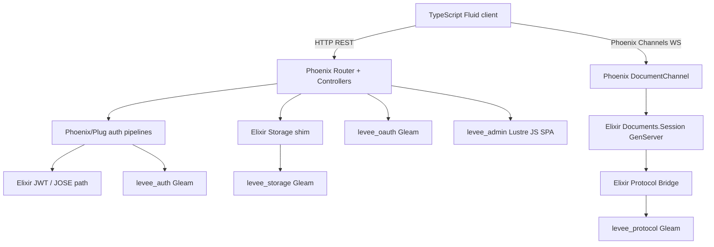
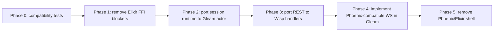

# Could Levee replace the Elixir stack with a full Gleam stack?

## Executive Summary

Yes, Levee could replace most of its Elixir/Phoenix stack with a Gleam stack, but it is not a small mechanical port. The core domain logic is already largely Gleam: protocol sequencing, auth, storage, OAuth, and the admin SPA all live in Gleam packages today.[^1] The remaining Elixir surface is concentrated in Phoenix HTTP/WebSocket infrastructure, OTP orchestration, bridge modules, and one substantial document-session GenServer.[^2]

The hardest part is not REST or storage; it is preserving the Phoenix Channels wire protocol used by the TypeScript Fluid client, including the JSON `vsn=2.0.0` path and the custom msgpack `vsn=3.0.0` path.[^3] A full Gleam replacement is feasible if the project either implements Phoenix-compatible channels in Gleam or accepts a coordinated client protocol change. The safest approach is incremental: remove Elixir dependencies from Gleam packages first, port the session runtime, then REST, then WebSockets, and only then remove the Phoenix application shell.

## Bottom Line

| Question | Answer |
|---|---|
| Can the domain logic be full Gleam? | Mostly yes; it already is. |
| Can Phoenix HTTP controllers be replaced? | Yes, with Wisp/Mist and existing Gleam auth/storage/protocol modules. |
| Can Phoenix Channels be replaced? | Yes, but it is the highest-risk work because of client wire compatibility. |
| Can Elixir be removed entirely from runtime? | Eventually, after eliminating Elixir FFI calls inside Gleam packages and replacing Phoenix HTTP/WS. |
| Recommended now? | Not as a big-bang rewrite. Do it incrementally with compatibility tests first. |

## Current Architecture Split

The Elixir layer is primarily an application/web adapter. Phoenix owns routing, controllers, plugs, endpoint configuration, WebSocket channel lifecycle, serializer selection, static file serving, and Phoenix telemetry.[^4] Gleam already owns protocol sequencing, session logic helpers, JWT/password/auth domain logic, storage backends, OAuth flow primitives, and the Lustre admin frontend.[^5]

## Key Components by Language

| Area | Current Elixir/Phoenix role | Existing Gleam role | Migration difficulty |
|---|---|---|---|
| Protocol sequencing | `Levee.Protocol.Bridge` adapts Elixir calls to Gleam | `levee_protocol` has sequencing, nacks, signals, summaries, validation | Easy; bridge disappears once callers are Gleam |
| Auth/JWT | Phoenix plugs and `Levee.Auth.JWT` use JOSE | `levee_auth` has users, tenants, sessions, password hashing, HS256 JWT | Medium; payload compatibility and JOSE removal needed |
| Storage | Elixir dispatch/shim and bridge modules | `levee_storage` has ETS/DETS and PostgreSQL backends | Easy to medium; remove interop once HTTP is Gleam |
| Document session runtime | `Documents.Session` GenServer manages clients, ops, summaries, direct sends | Protocol logic already in Gleam; no session actor yet | Hardest non-web component |
| REST API | Phoenix router/controllers/plugs | Wisp/Mist can replace primitives; handlers not written yet | Medium |
| WebSocket/channels | Phoenix Channels + custom MsgPack serializer | Mist raw WebSocket; beryl candidate for Phoenix-compatible channels | Hard/high-risk |
| Admin UI | Phoenix serves static files | `levee_admin` is already Gleam/Lustre JS | Easy |
| Supervision | Elixir `Application`, `DynamicSupervisor`, `Registry` | `gleam_otp` actors already used in auth/OAuth | Medium |

## Existing Gleam Head Start

Levee has five Gleam packages already:

| Package | Target | Responsibility |
|---|---|---|
| `levee_protocol` | Erlang | Sequencing, CSN/SN/MSN state, nacks, signals, summaries, validation, schema generation |
| `levee_auth` | Erlang | JWT, password hashing, users, tenants, sessions, invites, scopes, tenant secrets actor, session store actor |
| `levee_storage` | Erlang | Storage types, ETS/DETS backend, PostgreSQL backend, interop helpers |
| `levee_oauth` | Erlang | GitHub OAuth flow and CSRF state store actor |
| `levee_admin` | JavaScript | Lustre admin SPA |

Research found that `levee_auth/src/jwt.gleam` already implements HS256 signing/verification with `gleam_crypto`, while the Elixir `lib/levee/auth/jwt.ex` still uses JOSE.[^6] That means JOSE removal is mostly API and payload alignment, not a cryptography reimplementation.

## Hard Blockers to a No-Elixir Runtime

The surprising blocker is that some Gleam packages call Elixir modules from hand-written Erlang FFI files. These must be removed before a true no-Elixir runtime is possible.

| Blocker | Current purpose | Replacement |
|---|---|---|
| `Elixir.UniqueNamesGenerator` from `tenant_secrets_ffi.erl` | Human-readable tenant IDs | Pure Gleam/Erlang generator or UUID/word-list implementation |
| `Elixir.Jason.encode!/decode!` from storage FFI | JSON encode/decode for storage internals | `gleam_json`, Erlang `thoas`, or OTP `json` |
| `Elixir.DateTime/Date/Time` from storage FFI | Timestamp conversion | `gleam_time`, Erlang `calendar`, or Unix timestamps |
| `JOSE` via `Levee.Auth.JWT` | HS256 Fluid token sign/verify | Existing `levee_auth` JWT module, extended for Fluid payload shape |
| Phoenix/Plug | HTTP routing, middleware, endpoint, controllers | Wisp + Mist |
| Phoenix Channels | WebSocket topic multiplexing and client compatibility | beryl or custom Phoenix-wire-compatible Gleam implementation |
| `Msgpax` | `vsn=3.0.0` binary channel serializer | Erlang msgpack FFI or native Gleam msgpack implementation |

The first three are small but mandatory cleanup items because they are Elixir calls embedded below the Elixir web layer.[^7]

## HTTP Migration Feasibility

Phoenix REST routes can be ported to Wisp/Mist without changing external API shapes. The HTTP research found 31 routes across 11 controllers, plus four plugs and one endpoint.[^8] Most routes are CRUD wrappers around existing Gleam storage/auth modules, so the migration is largely request parsing, response shaping, and middleware composition.

Wisp covers the major Phoenix HTTP primitives Levee uses: JSON request/response helpers, cookies, redirects, static file serving, form/body parsing, middleware composition, and crash handling.[^9] Mist covers the underlying HTTP server and raw WebSocket upgrade path, including binary frames.[^10] CORS can be handled with `cors_builder` middleware.[^11]

The highest-risk REST handlers are:

1. `DocumentController#create`, because `process_initial_summary` recursively transforms a Fluid summary tree into blobs, trees, commits, and refs.[^12]
2. `OAuthController#callback`, because it combines OAuth completion, user creation/lookup, GitHub allowlist checks, session creation, cookie cleanup, and redirect-token handling.[^13]
3. `TokenMintController#create`, because the existing JOSE payload shape must match any Gleam JWT replacement.[^14]

Everything else is comparatively straightforward route/middleware porting.

## WebSocket / Phoenix Channels Feasibility

This is the core risk. The TypeScript client imports `phoenix` directly and uses Phoenix Channels semantics for socket construction, `channel.join().receive(...)`, `channel.push(...)`, event handlers, heartbeat, topic routing, reconnect, and optional msgpack serialization.[^15] Levee's endpoint currently accepts both Phoenix JSON serializer `~> 2.0.0` and a custom `LeveeWeb.MsgpackSerializer` for `~> 3.0.0`.[^16]

The research found a promising candidate: `tylerbutler/beryl`, a Gleam library by Levee's author that implements Phoenix-compatible channel concepts, topic routing, PubSub via Erlang `pg`, Phoenix-style wire messages, and Wisp transport.[^17] However, it is pre-1.0, git-based, and depends on a forked Wisp commit; msgpack compatibility is not complete for Levee's v3 path.[^18] The required upstream Beryl work is now tracked in dedicated issues so the migration can depend on explicit readiness criteria rather than a general "finish Beryl" task.[^29]

The realistic WebSocket options are:

| Option | Description | Pros | Cons |
|---|---|---|---|
| Use/finish beryl | Adopt beryl as the Phoenix-compatible Gleam channel layer | Preserves `phoenix.js` client path; same author; close conceptual fit | Pre-1.0, dependency risk, msgpack/vsn negotiation work |
| Build in-tree Phoenix wire layer | Implement only Levee's needed subset over Mist | Full control; can test against current server captures | More custom protocol maintenance |
| Change TypeScript client protocol | Drop Phoenix Channels and use a simpler raw WebSocket protocol | Simpler server | Breaking client change and coordinated package release |
| Keep Phoenix for WebSockets | Port REST/OTP but retain Phoenix channel endpoint | Lowest immediate risk | Not a full Gleam stack |

If "full Gleam stack" is a hard requirement, the recommended path is to preserve Phoenix wire compatibility in Gleam, not to change the client protocol first.

### Beryl Readiness Tracking

| Priority | Beryl issue | Why it matters for Levee |
|---|---|---|
| P0 | [`tylerbutler/beryl#42`: Wisp git-pin blocks Hex publishing][^29] | Levee should be able to consume Beryl as a stable Hex dependency instead of vendoring or git-pinning the library. |
| P0 | [`tylerbutler/beryl#43`: add `handle_info` callback][^30] | Levee's current `DocumentChannel` receives ops, signals, session `DOWN` messages, and deferred catch-up through `handle_info`. |
| P1 | [`tylerbutler/beryl#44`: `vsn` serializer negotiation and msgpack support][^31] | The TypeScript driver can use both JSON `vsn=2.0.0` and msgpack `vsn=3.0.0`; Beryl must preserve that compatibility if msgpack remains public API. |
| P1 | [`tylerbutler/beryl#45`: preserve `broadcast_from` sender exclusion cross-node][^32] | Fluid signal semantics rely on avoiding sender echoes, including in clustered deployments. |
| P1 | [`tylerbutler/beryl#46`: Phoenix-compatible `presence_diff` broadcast API][^33] | If Beryl becomes Levee's real-time/presence layer, presence changes need a documented Phoenix-compatible wire shape. |
| P2 | [`tylerbutler/beryl#47`: end-to-end Phoenix wire contract tests][^34] | Compatibility with `phoenix.js` should be guarded by real WebSocket contract tests before Levee removes Phoenix Channels. |
| P2 | [`tylerbutler/beryl#48`: segment-aware topic wildcard ergonomics][^35] | Levee can initially use `document:*`, but first-class matching for `document:{tenant_id}:{document_id}` would make multi-tenant routing safer. |

## OTP / Session Runtime Migration

The `Documents.Session` GenServer is the largest remaining Elixir runtime component. It tracks tenant/document IDs, sequence state, clients, client counters, op history, pending summaries, and latest summary metadata.[^19] Its public API includes `client_join`, `client_leave`, `submit_ops`, `submit_signals`, `get_ops_since`, `update_client_rsn`, `get_state_summary`, and `get_summary_context`.[^20]

Most of its actual protocol decisions already delegate to Gleam through `Levee.Protocol.Bridge`: sequence state creation/restoration, client join/leave, sequence assignment, MSN/current SN reads, feature negotiation, summary validation, signal recipient selection, nack construction, op history trimming, and sequenced-op builders.[^21]

The hard part is the process model. The Elixir session stores Phoenix Channel PIDs and sends raw Erlang messages like `{:op, message}` and `{:signal, message}` directly to those processes; the channel receives them through `handle_info`.[^22] Gleam actors prefer typed `Subject(message)` values rather than arbitrary untyped PIDs, so a clean port should introduce a typed channel-subject boundary or use a temporary Elixir shim.

`gleam_otp` can replace GenServer-style calls/casts, static supervisors, and factory supervisors, but a custom registry actor is likely needed because dynamic per-document atom names are unsafe.[^23]

## Recommended Migration Roadmap

### Phase 0: Build compatibility tests first

Before changing architecture, add an end-to-end TypeScript compatibility suite that connects with the existing `phoenix` client, joins a document, calls `connect_document`, submits ops, receives sequenced `op` broadcasts, submits signals, exercises reconnect/catch-up, validates nacks, and tests heartbeat behavior.[^24] Add REST contract tests that assert response status codes and JSON shapes for all routes. Capture both JSON v2 and msgpack v3 channel frames from the current server for future codec regression tests.

### Phase 1: Remove Elixir dependencies from Gleam packages

Replace `UniqueNamesGenerator`, `Jason`, and Elixir date/time FFI calls with Gleam/Erlang equivalents. This work is small, independent, and immediately clarifies whether the Gleam packages can run without Elixir loaded.[^7]

### Phase 2: Port document session runtime

Create a `levee_session` Gleam package with a session actor, session registry actor, and factory supervisor. Initially keep a thin Elixir shim so Phoenix `DocumentChannel` can call the same public API while the implementation moves to Gleam. This deletes most of `Levee.Protocol.Bridge` and reduces the core collaboration runtime's Elixir dependency.[^25]

### Phase 3: Port REST API to Wisp/Mist

Implement Wisp middleware equivalents for JWT auth, session auth, admin key auth, and admin-session auth. Port controllers in ascending risk order: health/static/read-only routes, git/storage mutations, document creation with initial summaries, auth/token minting, then OAuth. Preserve all route paths and response shapes.[^26]

### Phase 4: Replace Phoenix Channels

Either adopt beryl or implement an in-tree Phoenix-compatible channel layer over Mist. If adopting Beryl, treat issues #42 through #48 as the readiness checklist for this phase.[^29] It must support:

- WebSocket path `/socket/websocket`
- Phoenix frame shape `[join_ref, ref, topic, event, payload]`
- `phx_join`, `phx_leave`, `phx_reply`, `phx_error`, `phx_close`
- heartbeat replies on topic `"phoenix"`
- Levee events: `connect_document`, `submitOp`, `submitSignal`, `noop`, `requestOps`, `op`, `signal`, `nack`, `summaryAck`, `summaryNack`
- server-originated channel messages equivalent to Phoenix `handle_info` for ops, signals, monitors, and catch-up[^30]
- serializer selection for JSON `vsn=2.0.0` and msgpack `vsn=3.0.0` if msgpack support remains public API[^31]

### Phase 5: Remove Phoenix/Elixir shell

Port the root supervision tree to Gleam OTP, replace Phoenix telemetry with explicit `:telemetry` calls or a metrics actor, serve static admin assets through Wisp/Mist or a CDN, and keep a minimal Mix release shim only if release tooling still needs it.[^28]

## Risk Register

| Risk | Severity | Mitigation |
|---|---:|---|
| Phoenix Channels compatibility differs subtly from Phoenix | High | Build conformance tests against the existing server and `phoenix` npm client before migration |
| Msgpack v3 serializer is not available in Gleam | High | Add Erlang msgpack FFI or deprecate msgpack via a planned client release |
| Session actor loses disconnect cleanup semantics | High | Explicitly test monitor/DOWN behavior and client leave paths |
| Initial summary port breaks Fluid document attach/load | High | Port with golden fixtures and compare stored git object graph output |
| JWT payload mismatch between JOSE and Gleam JWT modules | Medium | Add a dedicated `sign_fluid_token`/`verify_fluid_token` with fixture parity tests |
| Wisp/Mist observability is less turnkey than Phoenix | Medium | Emit `:telemetry` events from request/channel wrappers |
| beryl dependency instability | Medium | Track Beryl readiness issues #42-#48; vendor temporarily or wait for Hex release; keep protocol tests as contract |

## Confidence Assessment

High confidence: the current core business logic is already mostly Gleam; Phoenix/Elixir is mainly the web/runtime adapter; REST migration is feasible with Wisp/Mist; the WebSocket layer is the dominant risk; and several Elixir FFI calls inside Gleam packages must be removed first.

Medium confidence: beryl may be the best migration accelerator because research found it implements Phoenix-like wire/channel concepts, but it is pre-1.0 and uses a forked Wisp dependency. Its production readiness needs direct evaluation before committing to it.

Lower confidence: exact effort estimates depend on the existing test coverage and whether msgpack v3 remains a supported public path. If msgpack can be deprecated, WebSocket migration becomes materially simpler; if it must be byte-compatible, codec work and regression testing are mandatory.

## Conclusion

Replacing the Elixir stack with full Gleam is feasible, but the right framing is "progressive runtime migration," not "rewrite Phoenix in Gleam all at once." The project already has the hardest domain pieces in Gleam. The remaining work is mostly edge infrastructure: OTP process boundaries, HTTP middleware/controllers, Phoenix-compatible channel transport, release packaging, telemetry, and a few Elixir FFI cleanup tasks.

The recommended next engineering step is not implementation; it is Phase 0 compatibility testing. Without a wire-protocol and REST contract harness, the migration risk is too high. With that harness, the team can move one layer at a time and keep the TypeScript client stable throughout.

## Footnotes

[^1]: `server/levee_protocol/src/`, `server/levee_auth/src/`, `server/levee_storage/src/`, `server/levee_oauth/src/`, `server/levee_admin/src/`; research report "Map Gleam capabilities", package inventory.
[^2]: `server/lib/levee/application.ex:16-42`; `server/lib/levee/documents/session.ex:1-830`; `server/lib/levee_web/router.ex:1-211`; `server/lib/levee_web/channels/document_channel.ex:1-500`.
[^3]: `client/packages/levee-driver/src/leveeDeltaConnection.ts:22-31,265-275`; `server/lib/levee_web/endpoint.ex:17-24`; `server/lib/levee_web/channels/msgpack_serializer.ex:1-62`.
[^4]: `server/lib/levee_web/endpoint.ex:1-59`; `server/lib/levee_web/router.ex:1-211`; `server/lib/levee_web/plugs/auth.ex:61-78`; `server/lib/levee_web/telemetry.ex:1-70`.
[^5]: `server/levee_protocol/src/levee_protocol/sequencing.gleam:1-252`; `server/levee_protocol/src/levee_protocol/session_logic.gleam:24-207`; `server/levee_auth/src/session_store.gleam:111-124`; `server/levee_oauth/src/levee_oauth.gleam:1-125`; `server/levee_storage/src/levee_storage/ets.gleam:1-688`.
[^6]: `server/lib/levee/auth/jwt.ex:64-84,118-130`; `server/levee_auth/src/jwt.gleam:40-88`; `server/mix.exs:50`.
[^7]: `server/levee_auth/src/tenant_secrets_ffi.erl:8,13`; `server/levee_storage/src/storage_ffi_helpers.erl:17-44`; `server/levee_storage/src/levee_storage_ets_backend.erl:135,189,326`.
[^8]: `server/lib/levee_web/router.ex:1-211`; research report "HTTP controller migration", route inventory.
[^9]: `gleam-wisp/wisp:src/wisp.gleam`; `hexdocs.pm/wisp/wisp.html` (`get_cookie`, `set_cookie`, `serve_static`, `require_json`, `json_body`, `redirect`).
[^10]: `rawhat/mist:src/mist.gleam`; `hexdocs.pm/mist/mist.html`; research report "Gleam web ecosystem", mist API summary.
[^11]: `ghivert/cors-builder:src/cors_builder.gleam`; `hexdocs.pm/cors_builder/`.
[^12]: `server/lib/levee_web/controllers/document_controller.ex:27-60,137-217`.
[^13]: `server/lib/levee_web/controllers/oauth_controller.ex:11-62,68-273`.
[^14]: `server/lib/levee_web/controllers/token_mint_controller.ex:8-51`; `server/lib/levee/auth/jwt.ex:64-84`; `server/levee_auth/src/jwt.gleam:40-53`.
[^15]: `client/packages/levee-driver/src/leveeDeltaConnection.ts:22-23,265-276,305-340,366-538`.
[^16]: `server/lib/levee_web/endpoint.ex:17-24`; `server/lib/levee_web/channels/msgpack_serializer.ex:13-62`.
[^17]: `tylerbutler/beryl:src/beryl/wire.gleam`; `tylerbutler/beryl:src/beryl/channel.gleam`; `tylerbutler/beryl:src/beryl/pubsub.gleam`; `tylerbutler/beryl:src/beryl/transport/websocket.gleam`.
[^18]: `tylerbutler/beryl:gleam.toml:12`; research report "Gleam web ecosystem", beryl dependency and msgpack/vsn notes.
[^19]: `server/lib/levee/documents/session.ex:50-64`.
[^20]: `server/lib/levee/documents/session.ex:74-129`.
[^21]: `server/lib/levee/protocol/bridge.ex:1-464`; `server/lib/levee/documents/session.ex:150-155,522-544,575-628`.
[^22]: `server/lib/levee/documents/session.ex:668-677,781-791`; `server/lib/levee_web/channels/document_channel.ex:254-279`.
[^23]: Research report "OTP session migration", Elixir OTP to Gleam OTP mapping; `server/lib/levee/documents/registry.ex:1-51`; `server/lib/levee/documents/supervisor.ex:1-19`.
[^24]: Research report "Full Gleam roadmap", Phase 0 test infrastructure; `client/packages/e2e/` noted as target package.
[^25]: Research report "OTP session migration", suggested migration sequence; `server/lib/levee/protocol/bridge.ex:1-464`.
[^26]: Research report "HTTP controller migration", recommended migration order and controller notes.
[^27]: Research report "Phoenix channel replacement", event inventory; `server/lib/levee_web/channels/document_channel.ex:54-330`; `server/lib/levee_web/channels/msgpack_serializer.ex:1-62`.
[^28]: Research report "Full Gleam roadmap", deployment and operations implications; `server/lib/levee/application.ex:100-143`; `server/Dockerfile:102-105`.
[^29]: [`tylerbutler/beryl#42`](https://github.com/tylerbutler/beryl/issues/42), "wisp git-pin in gleam.toml blocks Hex publishing"; `tylerbutler/beryl:gleam.toml`; `tylerbutler/beryl:manifest.toml`; upstream Wisp WebSocket PR [`gleam-wisp/wisp#144`](https://github.com/gleam-wisp/wisp/pull/144).
[^30]: [`tylerbutler/beryl#43`](https://github.com/tylerbutler/beryl/issues/43), "Add handle_info callback to Channel for OTP message delivery"; `tylerbutler/beryl:src/beryl/channel.gleam`; `server/lib/levee_web/channels/document_channel.ex:254-318`.
[^31]: [`tylerbutler/beryl#44`](https://github.com/tylerbutler/beryl/issues/44), "WebSocket transport missing vsn serializer negotiation and MessagePack support"; `tylerbutler/beryl:src/beryl/wire.gleam`; `tylerbutler/beryl:src/beryl/transport/websocket.gleam`; `server/lib/levee_web/endpoint.ex:17-24`; `server/lib/levee_web/channels/msgpack_serializer.ex:1-62`.
[^32]: [`tylerbutler/beryl#45`](https://github.com/tylerbutler/beryl/issues/45), "broadcast_from drops sender exclusion on cross-node PubSub path"; `tylerbutler/beryl:src/beryl.gleam`; `tylerbutler/beryl:src/beryl/pubsub.gleam`; `server/lib/levee_web/channels/document_channel.ex:188-209`.
[^33]: [`tylerbutler/beryl#46`](https://github.com/tylerbutler/beryl/issues/46), "Add Phoenix-compatible presence_diff broadcast API"; `tylerbutler/beryl:src/beryl/presence.gleam`; `tylerbutler/beryl:src/beryl.gleam`.
[^34]: [`tylerbutler/beryl#47`](https://github.com/tylerbutler/beryl/issues/47), "Add end-to-end Phoenix wire protocol contract tests"; `tylerbutler/beryl:src/beryl/wire.gleam`; `tylerbutler/beryl:src/beryl/transport/websocket.gleam`; `client/packages/levee-driver/src/leveeDeltaConnection.ts`.
[^35]: [`tylerbutler/beryl#48`](https://github.com/tylerbutler/beryl/issues/48), "topic.parse_pattern only supports trailing wildcard patterns"; `tylerbutler/beryl:src/beryl/topic.gleam`; `server/lib/levee_web/channels/user_socket.ex:5`; `server/lib/levee_web/channels/document_channel.ex:34-51`.
